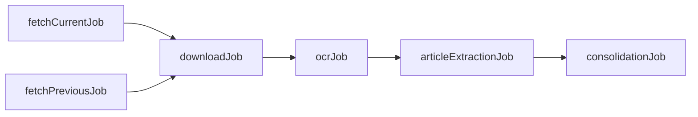

# io.law - Lois et Décrets du Bénin

[](https://openjdk.java.net/)
[](https://spring.io/projects/spring-boot)
[](https://spring.io/projects/spring-batch)
[](LICENSE)

Application Spring Batch multi-modules pour extraire, traiter et consolider les lois et décrets du gouvernement béninois depuis [sgg.gouv.bj/doc](https://sgg.gouv.bj/doc).

## 📋 Table des matières

- [Architecture](#-architecture)
- [Modules](#-modules)
- [Prérequis](#-prérequis)
- [Installation](#-installation)
- [Configuration](#️-configuration)
- [Utilisation](#-utilisation)
- [Tests](#-tests)
- [Workflow complet](#-workflow-complet)
- [Contribuer](#-contribuer)
- [Licence](#-licence)

## 🏗 Architecture

```
io.law/
├── law-common/          # Socle commun (modèles, repos, exceptions, config)
├── law-fetch/           # Jobs de récupération métadonnées
├── law-download/        # Job de téléchargement PDFs
├── law-tojson/          # Transformation PDF → JSON
│   ├── law-pdfToOcr/       # Extraction OCR
│   ├── law-OcrToJson/      # Parsing OCR → JSON
│   ├── law-AIpdfToJson/    # Extraction via IA
│   └── law-toJsonApp/      # Orchestration
├── law-consolidate/     # Job de consolidation BD
└── law-api/             # API REST + Orchestration
```

### Technologies

- **Java 17+** - Pattern matching, records, text blocks
- **Spring Boot 3.2.0** - Framework d'application
- **Spring Batch 5.1.0** - Traitement batch
- **MySQL 8** - Persistance des données
- **PDFBox 3.0** - Extraction de texte PDF
- **Tesseract OCR** (JavaCPP) - Reconnaissance optique de caractères
- **Ollama** (optionnel) - IA locale pour parsing
- **Groq API** (optionnel) - IA cloud pour parsing
- **H2 Database** - Tests en mémoire
- **JUnit 5** + **Mockito** - Tests unitaires

## 📦 Modules

### law-common
Socle commun partagé par tous les modules.

**Contenu** :
- **model/** : 7 entités JPA (`LawDocument`, `FetchResult`, `FetchCursor`, etc.)
- **repository/** : 7 repositories JPA
- **exception/** : 21 exceptions métier spécifiques
- **config/** : Configuration Spring (`LawProperties`, `GsonConfig`, `DatabaseConfig`)
- **util/** : Utilitaires (`FileStorageService`, `DateUtils`, `StringUtils`, etc.)

### law-fetch
Récupération des métadonnées des documents disponibles.

**Jobs** :
- `fetchCurrentJob` : Scan année courante (numéros 1-2000)
- `fetchPreviousJob` : Scan années 1960 à année-1 avec cursor

**Fonctionnalités** :
- Détection automatique des documents disponibles (HEAD HTTP)
- Gestion du cursor pour reprendre où le job s'est arrêté
- Détection des plages 404 pour optimiser les scans
- Rate limiting et retry automatique
- 38 tests unitaires ✅

### law-download
Téléchargement des PDFs des documents détectés.

**Job** : `downloadJob`

**Fonctionnalités** :
- Téléchargement avec retry et backoff
- Validation des magic bytes PDF (`0x25504446`)
- Détection des fichiers corrompus (PNG/JPG déguisés)
- Gestion du statut `CORRUPTED` pour fichiers invalides

### law-tojson
Extraction du contenu structuré des PDFs.

**Architecture** : 4 sous-modules avec stratégie de fallback

#### law-pdfToOcr
Extraction OCR des PDFs scannés.
- **Job** : `ocrJob`
- **Technologie** : Tesseract OCR
- **Output** : Fichiers `.txt`

#### law-OcrToJson
Parsing des fichiers OCR en JSON structuré.
- **Job** : `articleExtractionJob`
- **Technologie** : Regex patterns
- **Output** : Fichiers `.json` avec articles, signataires, métadonnées

#### law-AIpdfToJson
Extraction via IA (meilleure précision).
- **Job** : `iaExtractionJob`
- **Providers** : Ollama (local) ou Groq API (cloud)
- **Stratégie** : Fallback sur OCR si IA indisponible
- **Règle** : Ne jamais écraser un JSON avec confiance supérieure

#### law-toJsonApp
Application Spring Boot autonome orchestrant les 3 modules.

### law-consolidate
Import des JSON structurés dans MySQL.

**Job** : `consolidationJob`

**Fonctionnalités** :
- Parsing et validation des JSON
- Mapping vers entités JPA
- Bulk insert pour performance
- Update du statut `CONSOLIDATED`

### law-api
API REST et orchestration des jobs.

**Fonctionnalités** :
- Endpoints REST pour CRUD documents
- Lancement manuel des jobs via API
- Exécution CLI des jobs
- Monitoring des exécutions
- Documentation Swagger/OpenAPI

## 🔧 Prérequis

- **JDK 17+** : [OpenJDK](https://openjdk.java.net/) ou [Oracle JDK](https://www.oracle.com/java/technologies/downloads/)
- **Maven 3.8+** : [Apache Maven](https://maven.apache.org/download.cgi)
- **MySQL 8+** : [MySQL](https://dev.mysql.com/downloads/mysql/)
- **Tesseract OCR** (optionnel pour OCR) : [Tesseract](https://github.com/tesseract-ocr/tesseract)
- **Ollama** (optionnel pour IA locale) : [Ollama](https://ollama.ai/)

## 📥 Installation

### 1. Cloner le repository

```bash
git clone https://github.com/akimsoule/io.law.git
cd io.law
```

### 2. Créer la base de données

```sql
CREATE DATABASE law_db CHARACTER SET utf8mb4 COLLATE utf8mb4_unicode_ci;
CREATE USER 'law_user'@'localhost' IDENTIFIED BY 'your_password';
GRANT ALL PRIVILEGES ON law_db.* TO 'law_user'@'localhost';
FLUSH PRIVILEGES;
```

### 3. Compiler le projet

```bash
mvn clean install
```

### 4. Configurer l'application

Créer un fichier `law-api/src/main/resources/application-local.yml` :

```yaml
spring:
  datasource:
    url: jdbc:mysql://localhost:3306/law_db?useUnicode=true&characterEncoding=utf8mb4
    username: law_user
    password: your_password

law:
  storage:
    base-path: /path/to/data
  
  capacity:
    ia: 4   # Score RAM/CPU pour IA (16GB+ RAM)
    ocr: 2  # Score pour OCR (4GB+ RAM)
    ollama-url: http://localhost:11434
    ollama-models-required: qwen2.5:7b
  
  groq:
    api-key: ${GROQ_API_KEY:}  # Optionnel
```

## ⚙️ Configuration

### Variables d'environnement

```bash
# Base de données
export DATABASE_USERNAME=law_user
export DATABASE_PASSWORD=your_password

# API Groq (optionnel)
export GROQ_API_KEY=gsk_xxxxxxxxxxxxx
```

### Propriétés importantes

| Propriété | Description | Défaut |
|-----------|-------------|--------|
| `law.base-url` | URL du site SGG | `https://sgg.gouv.bj/doc` |
| `law.storage.base-path` | Répertoire de stockage | `/data` |
| `law.batch.chunk-size` | Taille des chunks | `10` |
| `law.batch.max-threads` | Threads concurrents | `10` |
| `law.batch.max-items-to-fetch-previous` | Items max cursor | `100` |
| `law.http.timeout` | Timeout HTTP (ms) | `30000` |
| `law.http.max-retries` | Tentatives max | `3` |

## 🚀 Utilisation

### Lancer l'API REST

```bash
cd law-api
mvn spring-boot:run
```

L'API sera disponible sur `http://localhost:8080`

Documentation Swagger : `http://localhost:8080/swagger-ui.html`

### Exécuter les jobs via API

```bash
# Fetch année courante
curl -X POST http://localhost:8080/api/jobs/fetchCurrentJob/run

# Fetch années précédentes
curl -X POST http://localhost:8080/api/jobs/fetchPreviousJob/run

# Télécharger les PDFs
curl -X POST http://localhost:8080/api/jobs/downloadJob/run

# Extraire le contenu (OCR + IA)
curl -X POST http://localhost:8080/api/jobs/ocrJob/run
curl -X POST http://localhost:8080/api/jobs/articleExtractionJob/run

# Consolider en base
curl -X POST http://localhost:8080/api/jobs/consolidationJob/run

# Pipeline complet
curl -X POST http://localhost:8080/api/jobs/fullPipelineJob/run
```

### Exécuter les jobs via CLI

```bash
cd law-api

# Lancer un job spécifique
java -jar target/law-api-1.0-SNAPSHOT.jar --job=fetchCurrentJob

# Job avec paramètres
java -jar target/law-api-1.0-SNAPSHOT.jar --job=fetchPreviousJob --year=2024

# Mode headless (sans serveur web)
java -jar target/law-api-1.0-SNAPSHOT.jar \
  --spring.main.web-application-type=none \
  --job=downloadJob
```

### API REST - Endpoints

```
# Jobs
POST   /api/jobs/{jobName}/run           # Lancer un job
GET    /api/jobs/{jobId}/status          # Status d'exécution

# Documents
GET    /api/laws                          # Liste des documents
GET    /api/laws/{id}                     # Détail d'un document
GET    /api/laws?type=loi&year=2024      # Filtrer par type/année
GET    /api/laws/search?q=budget          # Recherche full-text

# Monitoring
GET    /actuator/health                   # Health check
GET    /actuator/metrics                  # Métriques
```

## 🧪 Tests

### Exécuter tous les tests

```bash
mvn test
```

### Tests par module

```bash
# Tests law-fetch (38 tests)
mvn test -pl law-fetch -am

# Tests law-common
mvn test -pl law-common

# Tests avec couverture
mvn verify
```

### Statistiques de tests

- **law-fetch** : 38 tests ✅
  - `RateLimitHandlerTest` : 7 tests
  - `CurrentYearLawDocumentReaderTest` : 4 tests
  - `FetchProcessorTest` : 4 tests
  - `FetchWriterTest` : 6 tests
  - `FetchResultTest` : 4 tests
  - `FetchCursorTest` : 4 tests
  - `LawFetchServiceTest` : 4 tests
  - `NotFoundRangeServiceTest` : 5 tests

## 🔄 Workflow complet



### 1. Récupération des métadonnées

```bash
# Année courante
curl -X POST http://localhost:8080/api/jobs/fetchCurrentJob/run

# Années précédentes (avec cursor)
curl -X POST http://localhost:8080/api/jobs/fetchPreviousJob/run
```

**Résultat** : Documents avec statut `FETCHED`

### 2. Téléchargement des PDFs

```bash
curl -X POST http://localhost:8080/api/jobs/downloadJob/run
```

**Résultat** : Documents avec statut `DOWNLOADED` + fichiers `.pdf`

### 3. Extraction OCR

```bash
curl -X POST http://localhost:8080/api/jobs/ocrJob/run
```

**Résultat** : Documents avec statut `EXTRACTED` + fichiers `.txt`

### 4. Parsing en JSON

```bash
curl -X POST http://localhost:8080/api/jobs/articleExtractionJob/run
```

**Résultat** : Fichiers `.json` structurés

### 5. Consolidation en base

```bash
curl -X POST http://localhost:8080/api/jobs/consolidationJob/run
```

**Résultat** : Documents avec statut `CONSOLIDATED` + données en MySQL

## 📊 Statuts des documents

| Statut | Description |
|--------|-------------|
| `PENDING` | Créé, pas encore traité |
| `FETCHED` | Métadonnées récupérées (HEAD 200) |
| `DOWNLOADED` | PDF téléchargé |
| `EXTRACTED` | OCR effectué (fichier .txt créé) |
| `CONSOLIDATED` | Données en base MySQL |
| `FAILED` | Erreur générique |
| `CORRUPTED` | PDF corrompu (PNG déguisé, tronqué, etc.) |

## 🔐 Sécurité

- **Secrets** : Utiliser des variables d'environnement
- **Validation** : Tous les inputs sont validés
- **Path Traversal** : Protection contre `../` dans les IDs
- **SQL Injection** : Protection via JPA/Hibernate
- **Rate Limiting** : Gestion des 429 Too Many Requests

## 🎯 Principes de Clean Code

### Exceptions spécifiques
❌ `throws Exception` | ✅ `throws FetchException, IOException`

### Pas de null
❌ `return null` | ✅ `Optional<T>`, collections vides

### Constantes
❌ `"loi"` dupliqué | ✅ `LawDocument.TYPE_LOI`

### Try-with-resources
❌ `Stream.walk()` sans close | ✅ `try (Stream<Path> paths = ...)`

### Format multi-plateforme
❌ `\n` | ✅ `%n`

## 🤝 Contribuer

1. Fork le projet
2. Créer une branche (`git checkout -b feature/amazing-feature`)
3. Commit (`git commit -m '✨ Add amazing feature'`)
4. Push (`git push origin feature/amazing-feature`)
5. Ouvrir une Pull Request

### Conventions de commit

```
✨ feat: nouvelle fonctionnalité
🐛 fix: correction de bug
♻️ refactor: refactoring
📝 docs: documentation
✅ test: ajout de tests
🎨 style: formatage
⚡️ perf: amélioration performance
🔧 chore: tâches de maintenance
```

## 📄 Licence

Ce projet est sous licence MIT. Voir le fichier [LICENSE](LICENSE) pour plus de détails.

## 👥 Auteurs

- **Gouvernement du Bénin** - [Secrétariat Général du Gouvernement](https://sgg.gouv.bj)

## 🔗 Liens utiles

- [Documentation Spring Batch](https://spring.io/projects/spring-batch)
- [PDFBox Documentation](https://pdfbox.apache.org/)
- [Tesseract OCR](https://github.com/tesseract-ocr/tesseract)
- [Ollama](https://ollama.ai/)

## 📈 Roadmap

- [ ] Interface web pour visualiser les documents
- [ ] Export des données en Open Data
- [ ] API GraphQL
- [ ] Recherche sémantique avec embeddings
- [ ] Support des décrets présidentiels
- [ ] Intégration CI/CD
- [ ] Déploiement Docker/Kubernetes

---

**Note** : Ce projet est en cours de développement actif. Actuellement, le module `law-fetch` est complet et testé (38 tests ✅). Les autres modules sont en cours d'implémentation.
