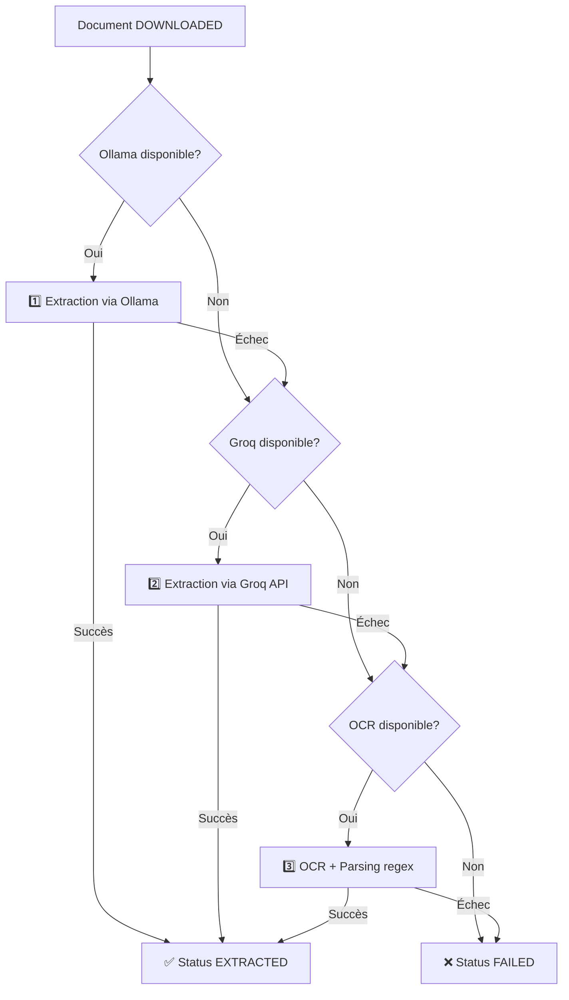

# law-json-config

Module de configuration Spring Batch pour le job de transformation **PDF → JSON**.

## 📋 Vue d'ensemble

Ce module configure **uniquement** le job `pdfToJsonJob` qui transforme les PDFs téléchargés en JSON structuré avec **stratégie de fallback automatique** :

1. **1ère tentative** : Ollama (IA locale)
2. **2ème tentative** : Groq API (IA cloud, fallback)
3. **3ème tentative** : OCR + Parsing regex (fallback final)

**Scope** : Transformation PDF → JSON uniquement (pas de fetch, pas de download, pas de consolidation).

## 🏗️ Architecture

### Job unique : pdfToJsonJob

```
pdfToJsonJob
└── pdfToJsonStep
    ├── DownloadedPdfReader (lit documents status=DOWNLOADED)
    ├── PdfToJsonProcessor (stratégie fallback Ollama → Groq → OCR)
    └── JsonResultWriter (sauvegarde JSON + update status=EXTRACTED)
```

### Stratégie Fallback détaillée



## 🔧 Configuration

### Propriétés YAML

```yaml
law:
  capacity:
    ia: 4   # Score RAM/CPU pour IA (0=désactivé, 4=16GB+)
    ocr: 2  # Score pour OCR (0=désactivé, 2=4GB+)
    ollama-url: http://localhost:11434
    ollama-models-required: qwen2.5:7b
  
  batch:
    chunk-size: 10
    max-threads: 8
    max-documents-to-extract: 50
```

### Beans Conditionnels

**`ocrJob`** : Créé seulement si `law.capacity.ocr=2`
```java
@Bean
@ConditionalOnProperty(name = "law.capacity.ocr", havingValue = "2", matchIfMissing = false)
public Job ocrJob() { ... }
```

**`articleExtractionJob`** : Toujours créé (utilise IA ou OCR selon disponibilité)

**`fullPipelineJob`** : Créé seulement si tous les modules sont disponibles (law-fetch, law-download, law-consolidate)

## 📦 Dépendances

### Modules internes obligatoires
- `law-json-common` : Modèles et utilitaires
- `law-pdf-ocr` : Service OCR Tesseract
- `law-ocr-json` : Service parsing regex
- `law-ai-pdf-json` : Service IA Ollama/Groq

### Modules externes optionnels (pour FullPipelineJob)
- `law-fetch` : Job récupération métadonnées
- `law-download` : Job téléchargement PDFs
- `law-consolidate` : Job consolidation MySQL

## 🚀 Utilisation

### Depuis law-app

```java
@SpringBootApplication
@Import(PdfToJsonJobConfiguration.class)
public class LawAppApplication {
    public static void main(String[] args) {
        SpringApplication.run(LawAppApplication.class, args);
    }
}
```

### Lancement des jobs

**Via API REST** (law-app) :
```bash
# Job OCR seul
POST /api/jobs/ocrJob/run

# Job extraction JSON
POST /api/jobs/articleExtractionJob/run

# Pipeline complet
POST /api/jobs/fullPipelineJob/run
```

**Via CLI** (law-app) :
```bash
# Job OCR
java -jar law-app.jar --job=ocrJob

# Job extraction
java -jar law-app.jar --job=articleExtractionJob

# Pipeline complet
java -jar law-app.jar --job=fullPipelineJob
```

## 🔍 Idempotence

**Règles strictes** :
- ✅ OCR : Skip si fichier `.txt` existe déjà avec contenu valide
- ✅ JSON : N'écrase que si confiance supérieure
- ✅ Pipeline : Chaque job vérifie statut avant traitement

## 📊 Monitoring

### Logs

```
🔧 Configuration ocrJob activée (capacity.ocr >= 2)
🔧 Configuration articleExtractionJob activée
🚀 [Pipeline 1/5] Lancement fetchCurrentJob...
✅ [Pipeline 1/5] fetchCurrentJob terminé avec statut: COMPLETED
```

### Métriques clés

- **Chunk size OCR** : 1 (CPU intensif)
- **Chunk size JSON** : 5 (moins intensif)
- **Skip limit** : Integer.MAX_VALUE (continue malgré erreurs)
- **Fault tolerance** : Activée (skip corrupted files)

## 🧪 Tests

```bash
# Tests unitaires
mvn test -pl law-tojson/law-json-config

# Tests d'intégration
mvn verify -pl law-tojson/law-json-config
```

### Tests disponibles

- `PdfToJsonJobConfigurationTest` : Validation beans conditionnels
  - ✅ Bean ocrJob créé si capacity.ocr=2
  - ✅ Bean articleExtractionJob toujours créé
  - ✅ Steps ocrStep et articleExtractionStep existent

## 🔗 Voir aussi

- [law-pdf-ocr](../law-pdf-ocr/README.md) : Implémentation OCR Tesseract
- [law-ocr-json](../law-ocr-json/README.md) : Implémentation parsing regex
- [law-ai-pdf-json](../law-ai-pdf-json/README.md) : Implémentation IA Ollama/Groq
- [law-app](../../law-app/README.md) : API REST et orchestration
